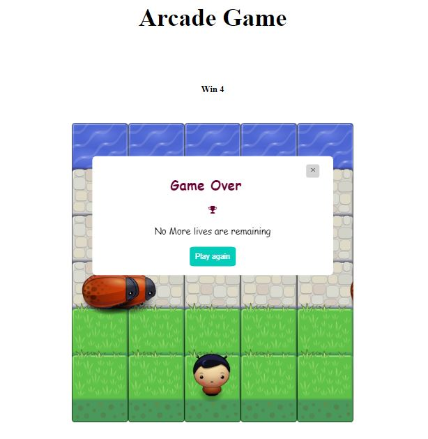

# Classic Arcade Game Clone Project

## Table of Contents

* [Info](#Info)
* [How to run](#HowToRun)
* [How To Play](#HowToPlay)
* [Specifications](#Specifications)

## Info
This is a project from Udacity's Nanodegree program "Front-End Web Developer" to show our knowledge of HTML, CSS, Javascript, Oops. The project consists on a game based on the arcade game Frogger by Konami.

## How To Run
* Download this github file or clone this repositiory to you local machine.
* Then open index.html file in the browser.
## How To Play

To play this game you can use 4 keys (Up, Down, Right , Left) to move player upside, downside right and left respectively.
player has to avoid enemies to reach to water level. Every time player reach to water level it will increase value of Win variable.
and every time player collides with the bug it will reduce 1 life of player.

After 5 collisions game will over and ask for restart.

## Initial State

## Game Over State

## Specifications

* Live count of all win moves.

* Making count for players 5 lives.

* After 5 collisions game will display game over modal box.

* Every time player collide eith the bug, it will reduce one life of player.

